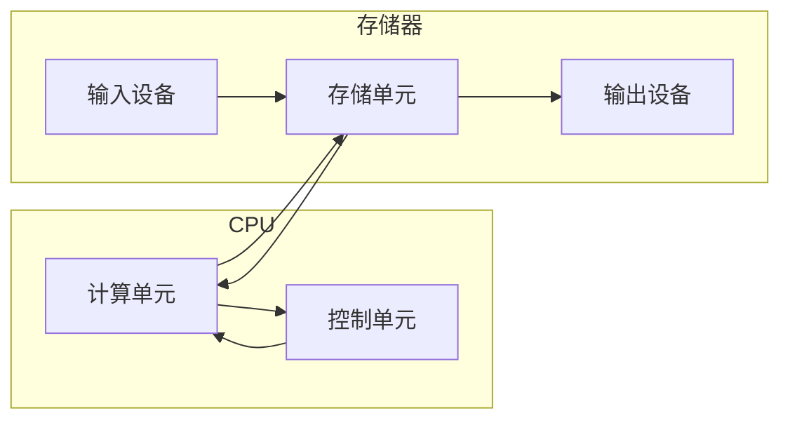

# 概述

:::info 组成架构
哈佛架构：指令和数据分别放在两个存储器中。（比冯诺伊曼快）

冯诺伊曼架构：运算器，存储器，控制器，输入设备，输出设备。

1. 指令和数据同等地位放在存储器中，并可按照地址寻址。
2. 计算机硬件系统由运算器、控制器、存储器、输入和输出 5 大部分组成。
3. 指令和数据均用二进制代码表示。
4. 指令由操作码和地址码组成，操作码用来表示操作的性质，地址码用来表示操作数在存储器中的位置。
5. 指令在存储器内按顺序存放，通常，指令是顺序执行的，在特定的条件下，可根据运算结果或根据设定的条件改变执行顺序。
6. 早期的冯诺依曼计算机以运算器为中心，输入 / 输出设备通过运算器与存储器交换信息。

:::

# 性能指标

1. CPI：执行一条指令所需要的平均周期数

2. MIPS：平均每秒执行多少百万条定点指令数

3. 外频：通常为系统总线的工作频率

4. 各个组件通过南桥与北桥连接至 CPU，

- 外频：CPU 与外部组件进行数据传输/运算时的速度

- 倍频：CPU 内部用来加速工作性能的一个倍数

两者相乘才是 CPU 的频率，比如 3.0 GHz 的外频是 333 MHz，倍频就是 9 （3.0 G = 333M*9，其中 1 G = 1000M）

超频：倍频一般出厂已锁定，所以只能调整外频的数值，从而达到频率提高，但是不稳定

CPU 运算的数据是由内存提供的，内存与 CPU 通信速度靠外部频率，那么每次可以传送数据量的大小就是总线的功能了，每次传送的位数称为「总线宽度」，也就是每秒钟可以传输的最大数据量。

目前常见的总线宽度就是 32 位与 64 位（bit）

CPU 每次能够处理的数据量称为 **字组大小（word size）**，字组大小依据 CPU 的设计有 32 位与 64 位。

- 所以早期 32 位 CPU 中只能最大支持 4 GB 的内存，就是因为每次解析数据量太小的缘故

- CPU 的引脚位不统一导致出现了 i386、i586 等名词出现，64 位 CPU 统称为 x86_64 等级

- CPU 频率与内存的关系

    理论上应该一致为好，比如 CPU 外频为 333HMz，则应该选择内存外频为 333MHz 的较好

双通道设计：一条内存数据宽度为 64，那么双通道则变为 64*2

- CPU 频率与内存的关系

    理论上应该一致为好，比如 CPU 外频为 333HMz，则应该选择内存外频为 333MHz 的较好

shell 是一个命令行解释器，它输出一个提示符（>>），等待输入一个命令行，然后执行命令。如果输入的是可执行文件的名字，就运行该文件。
