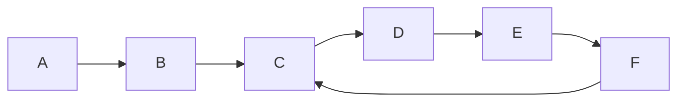

# 快乐数

编写一个算法来判断一个数 n 是不是快乐数。

:::success 快乐数
对于一个正整数，每一次将该数替换为它每个位置上的数字的平方和。  
然后重复这个过程直到这个数变为 1，也可能是 无限循环 但始终变不到 1。  
如果这个过程 结果为 1，那么这个数就是快乐数。  
如果 n 是 快乐数 就返回 true ；不是，则返回 false 。
:::



:::success 核心问题
判断是否在链表中存在循环！

或者其实是一个链表中是否有循环的问题
:::

## 双指针法


```cpp
class Solution {
public:
    int bitSquareSum(int n) {
        int sum = 0;
        while(n > 0)
        {
            int bit = n % 10;
            sum += bit * bit;
            n = n / 10;
        }
        return sum;
    }

    bool isHappy(int n) {
        int slow = n, fast = n;
        do{
            slow = bitSquareSum(slow);
            fast = bitSquareSum(fast);
            fast = bitSquareSum(fast);
        }while(slow != fast);

        return slow == 1;
    }
};
```


## hash表检测循环

算法分为两部分，我们需要设计和编写代码。

给一个数字 nnn，它的下一个数字是什么？
按照一系列的数字来判断我们是否进入了一个循环。
第 1 部分我们按照题目的要求做数位分离，求平方和。  
第 2 部分可以使用哈希集合完成。每次生成链中的下一个数字时，我们都会检查它是否已经在哈希集合中。

如果它不在哈希集合中，我们应该添加它。
如果它在哈希集合中，这意味着我们处于一个循环中，因此应该返回 false。

| 时间复杂度 | 空间复杂度 |
| ---------- | ---------- |
| O(logn)    | O(logn)    |

```python
def isHappy(self, n: int) -> bool:

    def get_next(n):
        total_sum = 0
        while n > 0:
            n, digit = divmod(n, 10)
            total_sum += digit ** 2
        return total_sum

    seen = set()
    while n != 1 and n not in seen:
        seen.add(n)
        n = get_next(n)

    return n == 1
```

:::success 启发
遇到判断中存在无限循环的问题, 需要考虑链表是否带环的问题.
:::