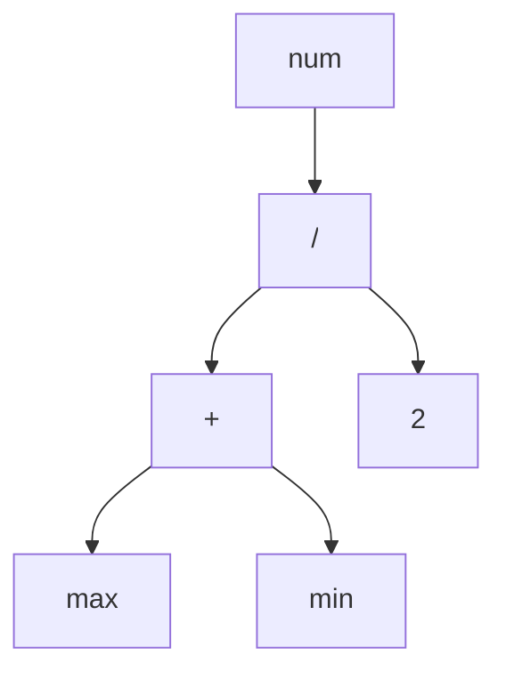

# 编译

source code：
```text
int num = ( max + min ) / 2;
```
## scanning

第一步是扫描，也就是所谓的词法分析 ( lexing 或者强调写法 lexical analysis )。扫描和词法分析的意思相近。我喜欢词法分析这个描述，因为这听起来像是一个邪恶的超级大坏蛋会做的事情，但我还是用扫描，因为它似乎更常见一些。

扫描器(词法解析器)接收线性字符流，并将它们切分成一系列更类似于“单词”的东西。在编程语言中，这些词的每一个都被称为词法单元。有些词法单元是单个字符，比如`{`和 `,`。其他的可能是几个字符长的，比如数字（123）、字符串字元（"hi!"）和标识符（min）。

源文件中的一些字符实际上没有任何意义。空格通常是无关紧要的，而注释，从定义就能看出来，会被变成语言忽略。扫描器通常会丢弃这些字符，留下一个干净的有意义的词法单元序列。

分解成：

`int` `num` `=` `(` `max` `+` `min` `)` `/` `2` `;`


## parsing
语法分析

The next step is parsing. This is where our syntax gets a grammar—the ability to compose larger expressions and statements out of smaller parts. Did you ever diagram sentences in English class? If so, you’ve done what a parser does, except that English has thousands and thousands of “keywords” and an overflowing cornucopia of ambiguity. Programming languages are much simpler.
下一步是解析。 这就是我们从句法中得到语法的地方——语法能够将较小的部分组成较大的表达式和语句。你在英语课上做过语法图解吗？如果有，你就做了解析器所做的事情，区别在于，英语中有成千上万的“关键字”和大量的歧义，而编程语言要简单得多。


解析器将扁平的词法单元序列转化为树形结构，树形结构能更好地反映语法的嵌套本质。这些树有两个不同的名称:解析树或抽象语法树，这取决于它们与源语言的语法结构有多接近。在实践中，语言黑客通常称它们为“语法树”、“AST”，或者干脆直接说“树”。

解析在计算机科学中有着悠久而丰富的历史，它与人工智能界有着密切的联系。今天用于解析编程语言的许多技术最初被人工智能研究人员用于解析人类语言，人工智能研究人员试图通过这些技术让计算机能与我们对话。
事实证明，人类语言对于只能处理僵化语法的解析器来说太混乱了，但面对编程语言这种简单的人造语法时，解析器表现得十分合适。唉，可惜我们这些有缺陷的人类在使用这些简单的语法时，仍然会不停地出错，因此解析器的工作还包括通过报告语法错误让我们知道出错了。




## Static analysis
静态分析

在所有实现中，前两个阶段都非常相似。 现在，每种语言的个性化特征开始发挥作用。 至此，我们知道了代码的语法结构（诸如哪些表达式嵌套在其他表达式中）之类的东西，但是我们知道的也就仅限于此了。
在a + b这样的表达式中，我们知道我们要把a和b相加，但我们不知道这些名字指的是什么。它们是局部变量吗？全局变量？它们在哪里被定义？
大多数语言所做的第一点分析叫做绑定或决议。对于每一个标识符，我们都要找出定义该名称的地方，并将两者连接起来。这就是作用域的作用——在这个源代码区域中，某个名字可以用来引用某个声明。

如果语言是静态类型的，这就是我们进行类型检查的时机。一旦我们知道了a和b的声明位置，我们也可以弄清楚它们的类型。然后如果这些类型不支持相加，我们就会报告一个类型错误[2]。
深吸一口气。 我们已经到达了山顶，并对用户的程序有了全面的了解。从分析中可见的所有语义信息都需要存储在某个地方。我们可以把它存储在几个地方：
通常，它会被直接存储在语法树本身的属性中——属性是节点中的额外字段，这些字段在解析时不会初始化，但在稍后会进行填充。
有时，我们可能会将数据存储在外部的查找表中。 通常，该表的关键字是标识符，即变量和声明的名称。 在这种情况下，我们称其为符号表，并且其中与每个键关联的值告诉我们该标识符所指的是什么。
最强大的记录工具是将树转化为一个全新的数据结构，更直接地表达代码的语义。这是下一节的内容。
到目前为止，所有内容都被视为实现的前端。 你可能会猜至此以后是后端，其实并不是。 在过去的年代，当“前端”和“后端”被创造出来时，编译器要简单得多。 后来，研究人员在两个半部之间引入了新阶段。 威廉·沃尔夫（William Wulf）和他的同伴没有放弃旧术语，而是新添加了一个迷人但有点自相矛盾的名称“中端”。


## 中间码Intermediate representations

你可以把编译器看成是一条流水线，每个阶段的工作是把代表用户代码的数据组织起来，使下一阶段的实现更加简单。管道的前端是针对程序所使用的源语言编写的。后端关注的是程序运行的最终架构。

在中间阶段，代码可能被存储在一些中间代码（intermediate representation， 也叫IR）中，这些中间代码与源文件或目的文件形式都没有紧密的联系（因此叫作 "中间"）。相反，IR充当了这两种语言之间的接口[3]。

这可以让你更轻松地支持多种源语言和目标平台。假设你想在x86、ARM、SPARC 平台上实现Pascal、C和Fortran编译器。通常情况下，这意味着你需要写九个完整的编译器：Pascal→x86，C→ARM，以及其他各种组合[4]。

一个共享的中间代码可以大大减少这种情况。你为每个产生IR的源语言写一个前端。然后为每个目标平台写一个后端。现在，你可以将这些混搭起来，得到每一种组合。

我们希望将代码转化为某种语义更加明确的形式，还有一个重要的原因是。。。


## 优化Optimization

一旦我们理解了用户程序的含义，我们就可以自由地用另一个具有相同语义但实现效率更高的程序来交换它——我们可以对它进行优化。

一个简单的例子是常量折叠：如果某个表达式求值得到的始终是完全相同的值，我们可以在编译时进行求值，并用其结果替换该表达式的代码。 如果用户输入：

pennyArea = 3.14159 * (0.75 / 2) * (0.75 / 2);

我们可以在编译器中完成所有的算术运算，并将代码更改为：

pennyArea = 0.4417860938;

优化是编程语言业务的重要组成部分。许多语言黑客把他们的整个职业生涯都花在了这里，竭尽所能地从他们的编译器中挤出每一点性能，以使他们的基准测试速度提高百分之几。有的时候这也会变成一种痴迷, 无法自拔。
我们在本书中通常会跳过这些棘手问题。令人惊讶的是许多成功的语言只有很少的编译期优化。 例如，Lua和CPython生成没怎么优化过的代码，并将其大部分性能工作集中在运行时上[5]。

## 代码生成code generation

我们已经将所有可以想到的优化应用到了用户程序中。 最后一步是将其转换为机器可以实际运行的形式。 换句话说，生成代码（或代码生成），这里的“代码”通常是指CPU运行的类似于汇编的原始指令，而不是人类可能想要阅读的“源代码”。

最后，我们到了后端，从山的另一侧开始向下。 从现在开始，随着我们越来越接近于思维简单的机器可以理解的东西，我们对代码的表示变得越来越原始，就像逆向进化。

我们需要做一个决定。 我们是为真实CPU还是虚拟CPU生成指令？ 如果我们生成真实的机器代码，则会得到一个可执行文件，操作系统可以将其直接加载到芯片上。 原生代码快如闪电，但生成它需要大量工作。 当今的体系结构包含大量指令，复杂的管线和足够塞满一架747行李舱的历史包袱。

使用芯片的语言也意味着你的编译器是与特定的架构相绑定的。如果你的编译器以x86机器代码为目标，那么它就无法在ARM设备上运行。追朔到上世纪60年代计算机体系结构 “寒武纪大爆发” 期间，这种缺乏可移植性的情况是一个真正的障碍[6]。

为了解决这个问题，专家开始让他们的编译器生成虚拟机代码，包括BCPL的设计者Martin Richards以及Pascal设计者Niklaus Wirth。他们不是为真正的芯片编写指令，而是为一个假设的、理想化的机器编写代码。Wirth称这种p-code为“可移植代码”，但今天，我们通常称它为字节码，因为每条指令通常都是一个字节长。

这些合成指令的设计是为了更紧密地映射到语言的语义上，而不必与任何一个计算机体系结构的特性和它积累的历史错误绑定在一起。你可以把它想象成语言底层操作的密集二进制编码。

## 虚拟机Virtual machine

如果你的编译器产生了字节码，你的工作还没有结束。因为没有芯片可以解析这些字节码，因此你还需要进行翻译。同样，你有两个选择。你可以为每个目标体系结构编写一个小型编译器，将字节码转换为该机器的本机代码[7]。你仍然需要针对你支持的每个芯片做一些工作，但最后这个阶段非常简单，你可以在你支持的所有机器上重复使用编译器流水线的其余部分。你基本上是把你的字节码作为一种中间代码。

或者，你可以编写虚拟机（VM）[8]，该程序可在运行时模拟支持虚拟架构的虚拟芯片。在虚拟机中运行字节码比提前将其翻译成本地代码要慢，因为每条指令每次执行时都必须在运行时模拟。作为回报，你得到的是简单性和可移植性。用比如说C语言实现你的虚拟机，你就可以在任何有C编译器的平台上运行你的语言。这就是我们在本书中构建的第二个解释器的工作原理。

## 运行时runtime

我们终于将用户程序锤炼成可以执行的形式。最后一步是运行它。如果我们将其编译为机器码，我们只需告诉操作系统加载可执行文件，然后就可以运行了。如果我们将它编译成字节码，我们需要启动VM并将程序加载到其中。

在这两种情况下，除了最基本的底层语言外，我们通常需要我们的语言在程序运行时提供一些服务。例如，如果语言自动管理内存，我们需要一个垃圾收集器去回收未使用的比特位。如果我们的语言支持用 "instance of "测试我们拥有什么类型的对象，那么我们就需要一些表示方法来跟踪执行过程中每个对象的类型。

所有这些东西都是在运行时进行的，所以它被恰当地称为，运行时。在一个完全编译的语言中，实现运行时的代码会直接插入到生成的可执行文件中。比如说，在Go中，每个编译后的应用程序都有自己的一份Go的运行时副本直接嵌入其中。如果语言是在解释器或虚拟机内运行，那么运行时将驻留于虚拟机中。这也就是Java、Python和JavaScript等大多数语言实现的工作方式。


## 捷径和备选路线
###  单遍编译器

一些简单的编译器将解析、分析和代码生成交织在一起，这样它们就可以直接在解析器中生成输出代码，而无需分配任何语法树或其他IR。这些单遍编译器限制了语言的设计。你没有中间数据结构来存储程序的全局信息，也不会重新访问任何之前解析过的代码部分。 这意味着，一旦你看到某个表达式，就需要足够的知识来正确地对其进行编译[9]。


Pascal和C语言就是围绕这个限制而设计的。在当时，内存非常珍贵，一个编译器可能连整个源文件都无法存放在内存中，更不用说整个程序了。这也是为什么Pascal的语法要求类型声明要先出现在一个块中。这也是为什么在C语言中，你不能在定义函数的代码上面调用函数，除非你有一个明确的前向声明，告诉编译器它需要知道什么，以便生成调用后面函数的代码。

### 树遍历解释器
有些编程语言在将代码解析为AST后就开始执行代码（可能应用了一点静态分析）。为了运行程序，解释器每次都会遍历语法树的一个分支和叶子，并在运行过程中计算每个节点。

这种实现风格在学生项目和小型语言中很常见，但在通用语言中并不广泛使用，因为它往往很慢。有些人使用“解释器”仅指这类实现，但其他人对“解释器”一词的定义更宽泛，因此我将使用没有歧义的“树遍历解释器”来指代这些实现。我们的第一个解释器就是这样工作的[10]。

### 转译器

为一种语言编写一个完整的后端可能需要大量的工作。 如果你有一些现有的通用IR作为目标，则可以将前端转换到该IR上。 否则，你可能会陷入困境。 但是，如果你将某些其他源语言视为中间代码，该怎么办？

你需要为你的语言编写一个前端。然后，在后端，你可以生成一份与你的语言级别差不多的其他语言的有效源代码字符串，而不是将所有代码降低到某个原始目标语言的语义。然后，你可以使用该语言现有的编译工具作为逃离大山的路径，得到某些可执行的内容。

人们过去称之为源到源编译器或转换编译器[11]。随着那些为了在浏览器中运行而编译成JavaScript的各类语言的兴起，它们有了一个时髦的名字——转译器。

虽然第一个编译器是将一种汇编语言翻译成另一种汇编语言，但现今，大多数编译器都适用于高级语言。在UNIX广泛运行在各种各样的机器上之后，编译器开始长期以C作为输出语言。C编译器在UNIX存在的地方都可以使用，并能生成有效的代码，因此，以C为目标是让语言在许多体系结构上运行的好方法。

Web浏览器是今天的 "机器"，它们的 "机器代码 "是JavaScript，所以现在似乎几乎所有的语言都有一个以JS为目标的编译器，因为这是让你的代码在浏览器中运行的主要方式[12]。

转译器的前端（扫描器和解析器）看起来跟其他编译器相似。 然后，如果源语言只是在目标语言在语法方面的换皮版本，则它可能会完全跳过分析，并直接输出目标语言中的类似语法。如果两种语言的语义差异较大，那么你就会看到完整编译器的更多典型阶段，包括分析甚至优化。然后，在代码生成阶段，无需输出一些像机器代码一样的二进制语言，而是生成一串语法正确的目标语言的源码（好吧，目标代码）。

### 即时编译

最后一个与其说是捷径，不如说是危险的高山争霸赛，最好留给专家。执行代码最快的方法是将代码编译成机器代码，但你可能不知道你的最终用户的机器支持什么架构。该怎么做呢？

你可以做和HotSpot JVM、Microsoft的CLR和大多数JavaScript解释器相同的事情。 在终端用户的机器上，当程序加载时（无论是JS源代码还者是平台无关的JVM和CLR字节码），都可以将其编译为对应的本地代码，以适应本机支持的体系结构。 自然地，这被称为即时编译。 大多数黑客只是说“ JIT”，其发音与“ fit”押韵。

最复杂的JIT将性能分析钩子插入到生成的代码中，以查看哪些区域对性能最为关键，以及哪些类型的数据正在流经其中。 然后，随着时间的推移，它们将通过更高级的优化功能自动重新编译那些热点部分[13]。


:::success 编译器和解释器的区别
编译是一种实现技术，其中涉及到将源语言翻译成其他语言--通常是较低级的形式。当你生成字节码或机器代码时，你就是在编译。当你移植到另一种高级语言时，你也在编译。

当我们说语言实现“是编译器”时，是指它会将源代码转换为其他形式，但不会执行。 用户必须获取结果输出并自己运行。

相反，当我们说一个实现“是一个解释器”时，是指它接受源代码并立即执行它。 它“从源代码”运行程序。
:::


