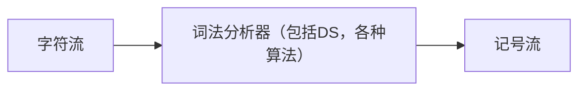

# 词法分析

1. 词法分析器(扫描器)`lexer` `scanner`:词法分析器一般以函数的形式存在，供语法分析器调用。词法分析（英语：lexical analysis）是计算机科学中将字符序列转换为标记`token`序列的过程。这里的标记是一个字串，是构成源代码的最小单位。从输入字符流中生成标记的过程叫作标记化（tokenization），在这个过程中，词法分析器还会对标记进行分类。词法分析器通常不会关心标记之间的关系（属于语法分析的范畴），举例来说：词法分析器能够将括号识别为标记，但并不保证括号是否匹配。



> 记号流是编译器内部定义的数据结构,编码所识别出的词法单元
目前实现方法:
1. 手工编码实现方法:相对复杂,容易出错.GCC,LLVM
2. 词法分析生成器
```cpp
sum=3+2;
```
经过词法分析器,如下:


|语素|	标记类型|
|-|-|
|sum	|标识符|
|=	|赋值操作符|
|3	|数字|
|+	|加法操作符|
|2	|数字|
|;	|语句结束|
