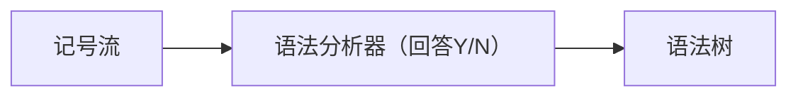

# 语法分析

import {Tag} from '@components'

<Tag>Syntax Analysis</Tag>

语法分析器:`syntactic analysis` `parsing`是根据某种给定的形式文法对由单词序列（如英语单词序列）构成的输入文本进行分析并确定其语法结构的一种过程。<br/>
语法分析器（parser）通常是作为编译器或解释器的组件出现的，它的作用是进行语法检查、并构建由输入的单词组成的数据结构（一般是语法分析树、抽象语法树等层次化的数据结构）。语法分析器通常使用一个独立的词法分析器从输入字符流中分离出一个个的“单词”，并将单词流作为其输入。实际开发中，语法分析器可以手工编写，也可以使用工具（半）自动生成.语法分析器的任务主要是确定是否可以以及如何从语法的起始符号推导出输入符号串（输入文本），主要可以通过两种方式完成：
    1. 自顶向下分析：根据形式语法规则，在语法分析树的自顶向下展开中搜索输入符号串可能的最左推导。单词按从左到右的顺序依次使用。
    2. 自底向上分析：语法分析器从现有的输入符号串开始，尝试将其根据给定的形式语法规则进行改写，最终改写为语法的起始符号。





## 文法

程序语言是符号语言，即一个记号系统，它主要有语法、语义和语用等三方面定义。


文法语言中的每个句子可以用严格定义的规则来构造,通俗地讲就是根据一些指定的规则来确定编程语言的语法从而实现编译器的功能.


语法：是对语言结构的定义（什么样的符号序列是合法的）。任何语言程序都可看成是一定字符集上的一字符串（有限序列），语法定义语言的词法和语法的形式规则。

字母表是一个有限的字符集，字符集中的字符是语言程序中可能出现的字符，它们是语言程序单词的组成部分。
词法规则定义了语言程序中单词符号的形成规则。即什么样的字符串是一个合法的单词。如标识符、数值常量、运算符等单词的构成规则。
语法规则定义了语言程序中语法单位的形成规则。一般语言的语法单位有表达式、语句、分程序、函数、过程和程序等。描述语法规则和进行语法分析的有效工具是上下文无关文法。
语义：描述语言的含义；定义语言的单词符号和语法单位的意义。目前编译程序中常用的语义分析方法是一种基于属性文法的语法制导翻译。即在语法分析的同时对其中识别出的语法单位进行语义的分析与翻译工作；在描述文法的同时为定义的语法范畴加上它们的属性计算规则，属性可以是语法范畴的类型、地址、取值、执行动作等信息。

语用：是从使用的角度去描述语言。定义程序设计技术和语言成分的使用方法，它使语言的基本概念与语言的外界（如数学概念或计算机的对象和操作）联系起来

字母表(alphabet)：字母表是元素的非空有穷集合，任何语言的字母表指出了该语言中允许出现的一切符号。

````
∑ = {a,b,c}
````
1. ∑是字母表，由 a,b,c 三个元素组成。
C 语言的字母表是字母、数字和若干专用符号组成。
2. 符号(symbol)：字母表中的元素称为符号，或称为字符。
a,b,c 是字母表 ∑ 中的符号。
3. 符号串(string):符号的有穷序列称为字符串。符号串总是建立在某个特定字母表上的且只能由字母表上的有穷多个符号组成。不包含任何符号的符号串，称为空符号串，用$\epsilon$表示
(a,b,ab,ba,cba,abc 等都是字母表∑上的符号串)

### 运算
1. 符号串的连结`catenation`
<br/>设 x 和 y 是符号串，则串 xy 称为它们的连结。`x = abc`，`y = 10a`,则`xy = abc10a`,`yx = 10aabc`.特别，对任意一符号串 x 有：$\epsilon x=x \epsilon=x$

2. 集合的乘积`product`
<br/>设 A 和 B 是符号串的集合，则 A 和 B 的乘积定义为：AB = \{xy | x ∈ A, y ∈ B}
<br/>设 A = \{a,b}, B = \{c,d}则 AB = \{ac,ad,bc,bd}
<br/>空集Φ`empty set`:Φ表示不含任何元素的空集 \{ }

3. 符号串的幂运算`power`
<br/>设 x 是符号串，则 x 的幂运算定义为：
$x^0 = ε ;x^1 = x;x^2 = xx,……,x^n = xx…x$

4. 集合的幂运算同理，只不过$A^0=\{ε\}$

5. 集合A的正闭包A+与闭包A
<br/>设 A 是符号串的集合，则集合 A 的正闭包 A+ 和闭包 A* 定义为：
$$$
A^+= A^1 \cup A^2 \cup A^3 \cup … \cup A^n \cup …
$$$
$$$
A^* = A^0 \cup A^1 \cup A^2 \cup A^3 \cup … \cup A^n \cup … = \{ \epsilon \} \cup A^+
$$$
:::success 例子
设 $A = \{a,b\}$,则
	$A^+ = \{a,b,aa,ab,ba,bb,aaa,aab,…\}	\\\\
	A* = \{\epsilon,a,b,aa,ab,ba,bb,aaa,aab,…\}$
:::


### 形式语言
形式语言：序列(字符串)的集合称为形式语言。每个形式语言都是某个字母表上按某种规则构成的所有符号串的集合；任何一个字母表上符号串的集合均可定义一个形式语言。
> C 语言是具有基本符号字母表上的符号串的集合。每个 C 语言程序是基本符号的符号串。

形式语言的描述有两种方法：

1. 当语言为有穷集合时，用枚举法来表示语言。
【例】设有字母表 A=\{a,b,c},则L1 = \{a,b,c},L2 = \{a,aa,ab,ac},L3 = \{c,cc}均表示字母表 A 上的一个形式语言。由于这三个语言均是有限符号串的集合，可以枚举出其全部句子来表示该语言。
2. 当语言为无穷集合时，需要设计文法来描述无穷集合的语言。
<br/>设有字母表 $\Sigma=\{0,1\}$,
则$\Sigma^+ = \Sigma^1 \bigcup\Sigma^2 \bigcup \Sigma^3 \bigcup … = \{0,1,00,10,11,01,000,100,…\}$
用 A 表示 $\Sigma^+$，用式子 A→0 表示符号串 0∈A 或 A 生成符号串 0
则集合 A 可表示成：A→0;A→1;A→A0;A→A1
显然由 A 生成的符号串属于 $\Sigma^+$，这就是文法描述语言，它描述了无穷集合的语言。

### 文法

#### 文法和规则

非终结符：出现在产生式左部能派生出符号或符号串的那些符号，即每个非终结符表示一定符号串的集合。用大写字母表示或用尖括号把非终结符括起来。 

终结符：是不属于非终结符的那些符号，它是组成语言的基本符号，是一个语言的不可再分的基本符号，只出现在产生式右部。通常用小写字母表示。

<span id='j1'>规则</span>
：规则也称产生式，由非终结符(大写字母AB...)和终结符(小写字母ab...αβ...)以及→组成的.它是一个符号与一个符号串的有序对(A,β)，通常写做A→β 或 (A::=β).其中 A 是规则左部，是一个符号；β是规则右部，是一个符号串。→ 或 ::= 表示“定义为”或“生成”，意思是左部符号用右部符号串定义或左部符号生成右部符号串。规则的作用是告诉如何用规则中的符号串生成语言中的序列。一组规则规定了一个语言的语法结构。

:::info 例子
产生式	A→A1 A→A0

A 是非终结符，0、1 是终结符
:::

文法：文法是[规则](#j1)的非空集合.可以表示为一个四元式G=(Ns,Es,Ps,S)，其中：
1. Ns(non-Terminals) 是一个非空有限集，它的每个元素为非终结符号
2. Es(Terminus) 是一个非空有限集，它的每个元素为终结符号； Ns ∩ Es = Φ
3. S(Start) 是一个非终结符号，称为开始符号或识别符号；开始符号 S 至少必须在某个产生式的左部出现一次。
4. Ps(productions) 是一个产生式集合（有限），每个产生式的形式是P→α，其 P ∈ Ns ， α ∈ (Ns ∩ Es)*。例如\{A→a,B→dba,S→Ab}
<br/>左部相同的产生式，如A→α1， A→α2， …， A→αn，可合并为一个，缩写为A→ α1|α2| … |αn

#### 文法与设计
1. 0型文法:左边必须包含这些元素或者元素组合中的至少一个非终结符右边可以是这些元素的任意组合
<br/>A→a
2. 1型文法(上下文有关法):可以由线性界限自动机自然语言接受.在零型文法的基础上是添加了一个要求右边的长度大于等于左边的长度
<br/>A→a,A→dba,S→ε
3. 2型文法(上下文无关文法):可以由下推自动机程序设计语言接受.他在一型文法的基础上又增加了一个要求左边必须是非终结符
<br/>AB→de.
4. 3型文法(正则文法):可以由有限自动机接受.它是在二型的基础上提出了要么一个非终结符推出一个终结符,要么一个非终结符推出一个终结符并且带一个非终结符.三型文法不是左右线性的组合要么都是右线性要么都是左线性
<br/>A→a|aB(右线性),A→a|Ba(左线性)

:::success 举例
1. 写出a(b|c)对应的正则文法
```
S->aA;
A->bA;
A->cA;
A->ε;
```

2. 设字母表∑＝\{a,b},试设计文法，描述语言 L=\{a^{2n}，b^{2n} | n≥1}
<br/>分析:设计文法来描述一个语言，关键是设计一组规则生成语言中的符号串。设计语言的文法，必须分析这个语言是由怎样一些符号串组成，即首先分析语言中符号串的结构特征：
```
当 n=1		L = {aa,bb}
当 n=2		L = {aaaa,bbbb}
当 n=3		L = {aaaaaa,bbbbbb}
…
L = {aa,bb,aaaa,bbbb,aaaaaa,bbbbbb,…}
```
语言 L 是由偶数个 a，偶数个 b 这样的符号串组成的集合。
因此
```text title="Grammars 1"
G = (Ns，Es，Ps，S)
Ns = {A,B,D};
Es = {a,b};
P = {
    A -> aa | aaB | bb | bbD;
    B -> aa | aaB;
    D -> bb | bbD;
};
S = A;
```
此外,描述文法不唯一
```text  title="Grammars 2"
G = (Ns,Es,Ps,S)
Ns = {A,B,D};
Es = {a,b};
P = {
    A -> B | D;
    B -> aa | aaB;
    D -> bb | bbD;
};
S = A;
```

3. 用文法定义一个含+,*,()的算数表达式.
<br/>分析:变量是表达式；若 E1 和 E2 是算术表达式，则 E1+E2，E1*E2，(E) 也是算术表达式。

```text title="Grammars"
G=(N,E,P,S):
N = {E}
E = {i,+,*,(,)}
P = {E -> i|E + E|E * E|(E)}
S = E
```

4. 设字母表∑＝\{a,b}，设计一个文法，描述语言 L=\{a$b^n$a | n $\ge$ 0}

```text title="Grammars"
G = ({A,B},{a,b},P,A)
P = {A -> aBa,B -> ε|Bb}
```
:::

## 语言形式定义


:::success 前置知识
语言：文法 G[S] 产生的所有句子的集合称为文法 G 所定义的语言，记为 L(G[S]):L(G[S]) = \{ x | S=>+x 且 x∈V_T^* }，由语言定义可知： (1)当文法给定，语言也就确定； (2)L(G) 是 V_T^* 的子集。即属于V_T^*的符号串不一定属于L(G)

句型:若文法G的开始符号为S,则从开始符号S能推导出的符号串称为文法的一个句型

句子:仅含终结符的句型是一个句子

即在文法 G[S]，`如果S=>*x`, x∈(N∪E)*，则称符号串 x 为文法 G[S]的句型. 如果`S=>*x`, x∈E*，则称符号串 x 为文法 G[S]的句子。

例如,有下列文法:
```
S→AB
A→aA|a
B→bB|b
```
用上述文法推导字符串`aaabbb`过程如下:
`S->AB->aAB->aaAB->aaaB->aaabB->aaabbB->aaabbb`

AB、aAB、aaAB、aaaB、aaabB、aaabbB和aaabbb都是上述文法的一个句型,但只有`aaabbb`为一个句子,因为其只含有终结符。
:::

### 直接推导

令 G 是文法，一步推导`=>`表示用某一规则的右部替换其左部。如果有 `xAy=>xαy`，仅当 A→α 是 G 的一个规则(产生式)，且 x、y ∈ (Es ∪ Ns)*，称 xAy 直接推出 xαy。

设有文法`G[S]=({S},{0,1},P,S)`;
其中P为`S->01 | 0S1`
则可直接推导出`S=>01,S=>0S1,0S1=>0011,00S11=>000S111...`

### 推导

推导：如果存在一个直接推导序列：`α_0=>α_1=>…=>a_n`则称这个序列是从α_0到α_n的长度为n推导，记为a_0=>+α_n

设有文法 `G[S] = ({A,B,C}, {i,+,*,(,)}, P, S)`

```text
P = {
    A → A + B | B,
    B → B * C | C,
    C → i | ( A ),
}
```

则对 `i+i*i` 有如下直接推导序列
	`E=>E+T=>T+T=>F+T=>i+T=>i+T*F=>i+F*F=>i+i*F=>i+i*i`
所以`E =>+i+i*i`

### 广义推导

α_0 =>*α_n 表示从α0 出发，经过 0 步或多步可推导α_n,也就是说α_0 =>*α_n 意味着： α_0 =α_n 或者α_0 =>+α_n

直接推导的长度为1，推导的长度大于等于1，广义推导的长度大于等于0

### 规范推导和规范归约

文法所定义的任一句型和句子，都可以根据文法推导出来，但同一个句型(句子)可以通过不同的推导序列推导出来，这是因为在推导过程中所选择非终结符的次序无关。

为了使句子能按一种确定的推导序列来产生，以便对句子的结构进行确定性的分析。通常只考虑两种特殊推导：

1. 最左推导是指对于一个推导序列中的每一步直接推导 α=>β，都对 α 中的最左非终结符进行替换。
2. 最右推导是指对于一个推导序列中的每一步直接推导 α=>β，都对 α 中的最右非终结符进行替换。
3. 最右推导也称为规范推导，用规范推导推导出的句型称为规范句型。每个句子都有规范推导，但对句型此结论并不成立。

```text title="规范推导"
对文法 G[N]:N →N’, N’→D | N’D, D →0 | 1 | 2 | … | 9
N=>N’=>N’D=>N’8=>D8=>88	规范推导
N=>N’=>N’D=>DD=>8D=>88	不是规范推导
```

归约：推导的逆过程。归约是与推导相对的概念，推导是把句型中的非终结符用规则的一个右部来替换的过程，而归约是句型中的某个子串用一个非终结符来替换的过程.用 =>· （实际上·在=>这个符号上面，==下面均用=>·表示这个符号==）表示归约。规范推导的逆过程，称为最左归约，也称为规范归约。

```
设 A→α是文法 G 的一个规则，则有
xAy => xαy
xαy  =>· xAy

设有文法 G[S]:S→AB, A→A0 | 1B, B→0 | S1
请给出句子 101001 的最左和最右推导。
分析：
最右推导是指在推导过程中任何一步α=>β(α和β都是句型)，都是对α中的最右非终结符进行替换。
S=>AB=>AS1=>AAB1=>AA01=>A1B01=>A1001=>1B1001=>101001
最左推导是指在推导过程中任何一步α=>β(α和β都是句型)，都是对α中的最左非终结符进行替换。
S=>AB=>1BB=>10B=>10S1=>10AB1=>101BB1=>1010B1=>101001
```

## 文法求语言

1. 设有文法G[S]: S→01 | 0S1，求该文法所描述的语言

分析：问题归结为由识别符号 S 出发，将推导出什么样的句子，也就是说 L(G[S])是由一些什么样的符号串所组成的集合，找出其中的规律，用式子或自然语言描述出来。

`S=>0S1=>00S11=>000S111=>…=>0^{n-1}S1^{n-1}=>0^n1^n` 即`S >=+ 0^n1^n` 所以此文法定义的语言为 `L(G[E]) = {0^n1^n | n ≥ 1}`

2. 设有文法G[S]: S→0S|1S|ε求该文法所定义的语言

该文法所确定的语言为
`L(G[S]) = {ε,0,1,00,01,10,11,…}
	   = { x | x∈{0,1}^* }`


3. 设有文法G[A]: A→yB,B→xB|x求该文法所定义的语言

从开始符号 A 出发，我们可以推出如下句子：
```
A => yB => yx
A => yB => yxB =>yxx
……
A => yB => yxB => … => yx…x
```
归纳得出从 A 出发可推导出所有以 y 开头后跟一个或任意多个 x 得字符串，即`L(G[A]) = { yx^n | n≥1 }`

## 递归规则与文法的递归性
递归规则：所谓递归规则，是指在规则的左部和右部具有相同的非终结符的规则。

如果文法中有规则 A→A... 	称为规则左递归
如果文法中有规则 A→...A 	称为规则右递归
如果文法中有规则 A→...A... 称为规则递归

文法的递归性：文法的递归性，是指对文法中任一非终结符，若能建立一个推导过程，在推导所得的符号串中又出现了该非终结符本身，则文法是递归的，否则是无递归性的。

若文法中有推导 `A =>+ A...` 	称为文法左递归
若文法中有推导 `A =>+ ...A` 	称为文法右递归
若文法中有推导 `A =>+ ...A...` 	称为文法递归

文法中使用递归规则，使得能用有限的规则去定义无穷集合的语言。

文法中有如下规则：
```
U →Vx
V →Uy | z
```
显然规则都不是递归规则，
但	U =>+ Uyx，则该文法是左递归的。

考虑文法 
```
G[A]:
A → aB | bB
B → a | b
```
该文法无递归性，由它描述的语言是有穷的。
```
L(G[A]) = {aa,ab,ba,bb}
```

考虑文法 
```
G[N1]:N1 → N, N → ND | D, D → 0 | 1 | 2
```
分析:该文法有直接左递归规则 N→ND，则称该文法为左递归文法或称文法左递归。
```
L(G[N1]) = {x | x∈{0,1,2}^+}
```
文法中使用了递归规则，使得可用有限的规则去刻画无穷集合的语言。
若不用递归规则来定义文法，需要用无穷多条规则去表示无穷集合的语言
当一个语言是无穷集合时，则定义该语言的文法一定是递归的。
程序设计语言都是无穷集合，因此描述它们的文法必定是递归的。


## 短语、直接短语和句柄

令G是一个文法，S是文法的开始符号，假定αβδ是文法G的一个句型，如果是S=>*αAδ且A =>+β则称β是相对于非终结符A的句型αβδ的短语。特别是，如果有S=>*αAδ且A=>β则称β是直接短语（简单短语）。

短语是句型的一部分。

考虑文法 
```
G[N1]:
N1 -> N;
N → ND | D;
D → 0 | 1 | 2;
```
对于句型 ND
```
N1 =>* N //(1)
N1 =>* εNε 
N =>+ ND //(2)
```
所以ND是句型ND的短语，并且是直接短语

句柄：一个句型的最左直接短语称为该句型的句柄。 

特征： 
1. 它是直接短语，即某规则右部
2. 它具有最左性。

短语、直接短语和句柄都是针对某一句型的，特指句型中的哪些符号串能构成短语和直接短语，离开具体的句型来谈短语、直接短语和句柄是无意义的。.

:::success 例子
设有文法G[S]=(\{S,A,B},\{a,b},P,S) 
S →AB A →Aa | bB B →a|Sb 
求句型 baSb 的全部短语、直接短语和句柄

解题：

根据短语定义，可以从句型的推导过程中找出其全部短语、直接短语和句柄。
1. 建立句型的推导过程： `S=>AB=>bBB=>baB=>baSb` 
2. 最左推导 `S=>AB=>ASb=>bBSb=>baSb`
3. 最右推导 略
:::

## 参考

[编译原理-文法基础](https://juejin.cn/post/6844904069539053575#heading-10)

