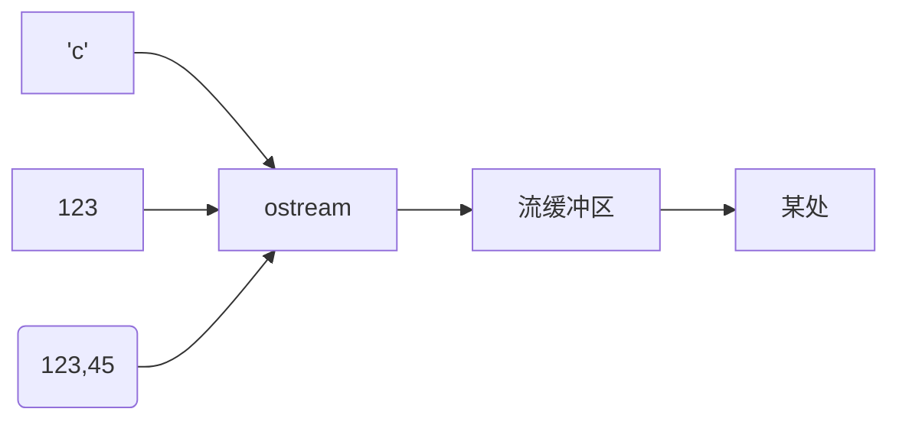
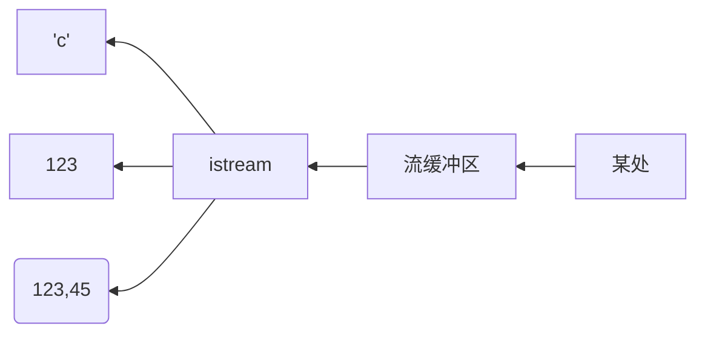

# IO


C++ comes with libraries that provide us with many ways for performing input and output. In C++ input and output are performed in the form of a sequence of bytes or more commonly known as streams.

Input Stream: If the direction of flow of bytes is from the device(for example, Keyboard) to the main memory then this process is called input.
Output Stream: If the direction of flow of bytes is opposite, i.e. from main memory to device( display screen ) then this process is called output.

Header files available in C++ for Input/Output operations are: 

1. iostream: iostream stands for standard input-output stream. This header file contains definitions of objects like cin, cout, cerr, etc.
2. iomanip: iomanip stands for input-output manipulators. The methods declared in these files are used for manipulating streams. This file contains definitions of setw, setprecision, etc.
3. fstream: This header file mainly describes the file stream. This header file is used to handle the data being read from a file as input or data being written into the file as output.
4. bits/stdc++: This header file includes every standard library. In programming contests, using this file is a good idea, when you want to reduce the time wasted in doing chores; especially when your rank is time sensitive. To know more about this header file refer this article.

IOstream库提供了文本和数值的io功能, 这种输出是带缓冲的,可以是格式化的,也可以是未格式化的.

ostream对象将有类型的对象转换为一个字符(字节)流:


istream对象将一个字符(字节)流转换为有类型的对象:


:::success[信息]
图形化io是通过相应的库来处理的, 这些库并不是iso标准库的一部分, 因此本书并未涉及.

标准库流可用于二进制io,不同字符类型,不同区域设置,使用高级缓冲策略等等(不讨论).

标准库流可以对std::string进行输入输出, 对string缓冲区进行格式化输入输出以及进行文件io

所有io流类都有析构函数, 用来释放拥有的所有资源(如缓冲区和文件句柄).
:::


## 读入输出优化

在默认情况下，std::cin/std::cout 是极为迟缓的读入/输出方式，而 scanf/printf 比 std::cin/std::cout 快得多。

:::warning[备注]
cin/cout 与 scanf/printf 的实际速度差会随编译器和操作系统的不同发生一定的改变。如果想要进行详细对比，请以实际测试结果为准。
:::

### 关闭同步/解除绑定

```cpp
std::ios::sync_with_stdio(false)
```

这个函数是一个「是否兼容 stdio」的开关，C++ 为了兼容 C，保证程序在使用了 `printf` 和 `std::cout` 的时候不发生混乱，将输出流绑到了一起。同步的输出流是线程安全的。

这其实是 C++ 为了兼容而采取的保守措施，也是使 cin/cout 速度较慢的主要原因。我们可以在进行 IO 操作之前将 stdio 解除绑定，但是在这样做之后要注意不能同时使用 std::cin 和 scanf，也不能同时使用 std::cout 和 printf，但是可以同时使用 std::cin 和 printf，也可以同时使用 scanf 和 std::cout。

#### tie
tie 是将两个 stream 绑定的函数，空参数的话返回当前的输出流指针。

在默认的情况下 std::cin 绑定的是 std::cout，每次执行 `<<` 操作符的时候都要调用 flush() 来清理 stream buffer，这样会增加 IO 负担。可以通过 std::cin.tie(0)（0 表示 NULL）来解除 std::cin 与 std::cout 的绑定，进一步加快执行效率。

但需要注意的是，在解除了 std::cin 和 std::cout 的绑定后，程序中必须手动 flush 才能确保每次 std::cout 展现的内容可以在 std::cin 前出现。这是因为 std::cout 被 buffer 为默认设置。例如：
```cpp
std::cout
    << "Please input your name: "
    << std::flush;  // 或者: std::endl;
                    // 因为每次调用std::endl都会flush输出缓冲区，而 \n 则不会。
// 但请谨慎使用，过多的flush会影响程序效率
std::cin >> name;
```
实现:
```cpp
std::ios::sync_with_stdio(false);
std::cin.tie(0);
// 如果编译开启了 C++11 或更高版本，建议使用 std::cin.tie(nullptr);
```

:::success[备注]
scanf 和 printf 依然有优化的空间，这就是本章所介绍的内容——读入和输出优化。

注意，本页面中介绍的读入和输出优化均针对整型数据，若要支持其他类型的数据（如浮点数），可自行按照本页面介绍的优化原理来编写代码。
:::

### 优化

众所周知，getchar 是用来读入 1 byte 的数据并将其转换为 char 类型的函数，且速度很快，故可以用「读入字符——转换为整型」来代替缓慢的读入

每个整数由两部分组成——符号和数字

整数的 '+' 通常是省略的，且不会对后面数字所代表的值产生影响，而 '-' 不可省略，因此要进行判定

10 进制整数中是不含空格或除 0~9 和正负号外的其他字符的，因此在读入不应存在于整数中的字符（通常为空格）时，就可以判定已经读入结束

ascii
C 和 C++ 语言分别在 ctype.h 和 cctype 头文件中，提供了函数 isdigit, 这个函数会检查传入的参数是否为十进制数字字符，是则返回 true，否则返回 false。对应的，在下面的代码中，可以使用 isdigit(ch) 代替 `ch >= '0' && ch <= '9'`.

```cpp
int read() {
  int x = 0, w = 1;
  char ch = 0;
  while (!isdigit(ch)) {  // ch 不是数字时
    if (ch == '-') w = -1;        // 判断是否为负
    ch = getchar();               // 继续读入
  }
  while (isdigit(ch)) {  // ch 是数字时
    x = x * 10 + (ch - '0');  // 将新读入的数字「加」在 x 的后面
    // x 是 int 类型，char 类型的 ch 和 '0' 会被自动转为其对应的
    // ASCII 码，相当于将 ch 转化为对应数字
    // 此处也可以使用 (x<<3)+(x<<1) 的写法来代替 x*10
    ch = getchar();  // 继续读入
  }
  return x * w;  // 数字 * 正负号 = 实际数值
}
```
所以读入数字可以写作:
```cpp
int num = read();
```