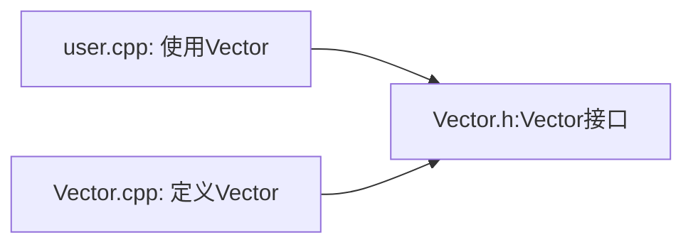
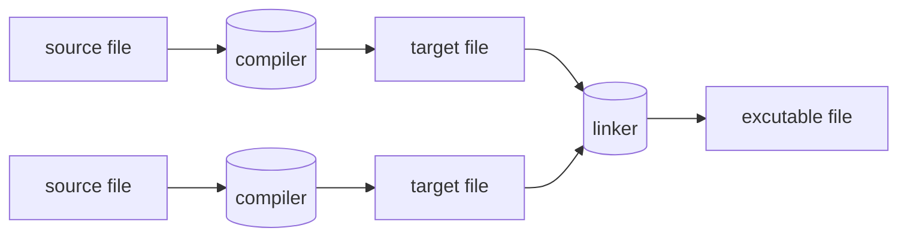

# 程序和模块

## 程序

## programming

```cpp title="minimum programming"
int main(){}
```

`{}`指出函数的边界。
`//`行注释

每个c++程序有且只有一个名为main的全局函数。它是程序的起点。如果main返回一个`int`类型的值，是程序返回给系统的值。main()不返回任何值,系统同样会收到一个表示程序成功完成的值.main()返回非零值表示程序执行失败.

```cpp
#include <iostream>

int main(){
    std::cout << "Hello world!\n";
}
```

`<<`输出符号,它的第二个参数写入第一个参数中. 在这个例子中,字符串字面值"Hello world!\n"被写入标准输出流std::cout.

std::指出名字cout可在标准库名字空间中找到.

```cpp
#include <iostream>

using namespace std;

double square(double x) { return x*x}

void print_square(double x) {
    cout << "square of " << x << "is" << square(x) << "\n";
}

int main() {
    print_square(1.234);
}
```

## 模块

一个C程序包含许多独立开发的部分，例如函数，用户自定义类型，类层次和模板。其管理的关键就是清晰的定义。这些组成部分之间的交互。第一步也是最重要的一步是将每一个部分的接口和实现分离开来。在语言层面，C使用声明来表达接口。声明Declaration指明了使用一个函数或者一个类型所需要的东西。

```cpp title="declaration"
double sqrt(double);

class Vector {
public:
    Vector(int s);
    double& operator[](int i);
    int size();
private:
    double* elem;
    int sz;
};
```

这里的关键点是函数体，即函数的定义是位于别处的. 我们可能也想让Vector的表示位于别处, 不过稍后将在对此进行介绍. 

定义:

```cpp title="definition"
Vector::Vector(int x):elem{new double[x]},sz{x}{}
double& Vector::operator[](int x){return elem[i]}
int Vector::size(){return sz;}
```


## 分别编译

C++ 支持一种分别编译的概念. 用户代码只能看见所用类型和函数的声明. 这些类型和函数的定义放置在分离的源文件中,被分别编译. 这种机制有助于将一个程序组织成一组半独立的代码片段。这种分离可以用来最小化编译时间。并严格强制程序中逻辑独立的部分分离开来。库通常是一组分别编译的代码片段，如函数的集合。通常我们将说明模块接口的声明放置在一个文件中。文件名指示出预期用途。

```cpp title="Vector.h"
class Vector {
public:
    Vector(int s);
    double& operator[](int i);
    int size();
private:
    double* elem;
    int sz;
};
```

我们称这种文件为头文件`header file`。用户将其包含到自己程序中，以便访问接口。

```cpp title="user.cpp"
#include "Vector.h"
double sqrt_sum(){

};
```

为了帮助编译器确保一致性, 负责提供Vector实现部分的.cpp文件同样应该办好提供接口的.h文件. 

```cpp title="Vector.cpp"
#include "Vector.h"

Vector::Vector(int x):elem{new double[x]},sz{x}{}
double& Vector::operator[](int x){return elem[i]}
int Vector::size(){return sz;}
```

user.cpp和Vector.cpp中的代码共享Vector.h中提供的接口信息,但这两个文件是相互独立的,可以被分别编译.




## module(C++20)

使用#include是一种古老的易出错的且代价相当高的程序模块化组织方式。如果你在101个编译单元中使用它。编译器将会处理头文件文本101次。如果你在header2.h之前使用header1.h,则header1.h的声明和宏可能影响header2.h中代码的含义.

```cpp title="Vector.cpp"
module; //将该编译单元定义为一个模块

export module Vector; // 定义成为Vector的模块

export class Vector{
public:
    Vector(int s);
    double& operator[](int i);
    int size();
private:
    double* elem;
    int sz;
};

Vector::Vector(int x):elem{new double[x]},sz{x}{}
double& Vector::operator[](int x){return elem[i]}
int Vector::size(){return sz;}

export int size(const Vector& v){
    return v.size()
};
```

Vector模块导出了类Vector及其所有成员函数和非成员函数size. 

```cpp title="使用"
import Vector;
#include <cmath> //获取标准库数学函数接口, 包含sqrt()

double sqrt_sum(Vector& v){
    double sum = 0;
    for (int i = 0; i < v.size(); ++i) sum += std::sqrt(v[i]);
    return sum;
}
```

> 标准库也可以使用import

头文件和模块的差异不只是在语法上.
1. 一个模块只会编译一遍
2. 两个模块可以按任意顺序导入
3. 如果你将一些东西导入一个模块中,则模块的使用者不会隐式的获得这些东西的访问权(但也不会被他们所困扰): import无传递性


## namespace

用来表达某些声明属于一个整体以及他们的名字不会和其他名字发生冲突. 

```cpp title="namespace"
namespace My_code{
    class complex{
        //...
    };
    complex sqrt(complex);
    //...
    int main();
}

int My_code::main(){
    complex z{1,2};
    auto z2 = sqrt(z);
    std::cout << "{" << z2.real() <<"," << z2.imag() << std::endl;
}

int main(){
    return My_code::main();
};
```

将命名空间引入作用域:
```cpp title="using"
void my_code(vector<int>& x, vector<int>& y, vector<int>& z){
    using std::swap;
    swap(x, y);
    other::swap(x, y); //其他的某个swap
}

using namespace std; //获取标准库名字空间的所有名字的访问权

```


## 程序

一个 C++ 程序是一个含有声明的文本文件（通常为头文件与源文件）序列。它们被翻译成一个可执行程序，C++ 实现通过调用其主 (main) 函数执行这一程序。

在 C++ 程序中，一些被称为关键词的词语有着特殊的含义。其它词语可以被用作标识符。在翻译的过程中，注释会被忽略。C++ 程序也包含字面量，其中的字符的值由字符集与编码指定。程序中的某些特定字符必须通过转义序列表示。

C++ 程序中的实体entity包括值、对象、引用、结构化绑定`C++17`、函数、枚举项、类型、类成员、模板、模板特化、形参包`C++11`和命名空间。预处理器宏不是 C++ 实体。

声明可以引入实体，将它们与名字关联起来，并定义其属性。能够定义使用一个实体所需的所有属性的声明是定义。对任何被 ODR 使用的非内联函数或变量，程序中必须只含有其一个定义。

函数的定义通常包括一系列的语句，其中部分会包含表达式。表达式指定了程序需要进行的运算。

程序中遇到的名字通过名字查找与引入它们的声明关联起来。每个名字都只在称为其作用域的程序部分中有效。有些名字有链接，这使得它们即使出现在不同的作用域或翻译单元时也代表相同的实体。

C++ 中的每一个对象、引用、函数和表达式都会关联一个类型。类型可以分为基础类型，复合类型，或用户定义类型，以及完整或不完整的类型等。

被声明的且不是非静态数据成员的对象和引用是变量。

C++是一种编译型语言。为了让程序运行,首先要用编译器处理源代码文本,生成目标文件,然后再用连接器将目标文件组合成可执行程序。一个C++程序通常包含多个源代码文件,通常简称为源文件(source file)。


可执行程序都是为特定的硬件系统组合创建的。不具有可移植性。比如Mac上的程序就无法移植到Windows PC上。当谈论C程序的可移植性时，谈论的是源代码的可移植性。即源代码可以在不同系统上成功编译并运行。

