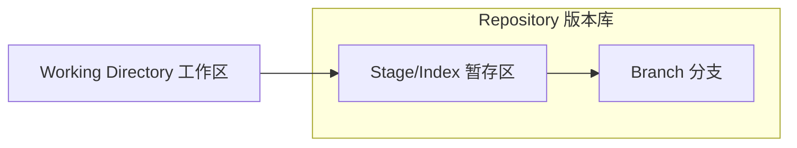

# Git

:::success 什么是版本控制？

你可以把一个版本控制系统（缩写VCS）理解为一个“数据库”，在需要的时候，它可以帮你完整地保存一个项目的快照。当你需要查看一个之前的快照（称之为“版本”）时，版本控制系统可以显示出当前版本与上一个版本之间的所有改动的细节。

版本控制与项目的种类，使用的技术和基础框架并无关系：

- 无论是设计开发一个HTML网站或者是一个苹果应用，它的工作原理都是一样的。

- 你可以选择任何你喜欢的工具来工作，它并不关心你用什么样的文本编辑器，绘图程序，文件管理器或其他工具。

因此不要混淆版本控制的备份系统和一般的部署系统。当你开始尝试在你的项目中使用版本控制，你不需要替换和改变开发过程中使用的那些常用工具。

版本控制系统会记录所有对项目文件的更改。这就是版本控制，听起来很简单。

:::

git是分布式版本控制系统，CVS及SVN都是集中式的版本控制系统.

Git 项目包含三个主要组件：
1. 存储库：跟踪项目文件所有更改的“容器”。它保存着您团队所做的所有提交。您可以使用 git 日志命令访问提交历史记录。是用于存储代码的位于中心的文件夹。一旦拥有包含文件和目录的 Git 存储库，就可以开始跟踪更改和版本。
2. 工作区/工作空间：由您正在处理的文件组成。您可以将工作树视为一个文件系统，您可以在其中查看和修改文件。
3. 暂存区/索引：准备提交的地方。暂存后，工作树中的文件将与存储库中的文件进行比较。对工作树中文件的更改在提交之前被标记为已修改。




## 工作区
`Working Directory`就是你在电脑里能看到的目录，比如我的文件夹就是一个工作区.

```yaml title="example"
panovista:
  - .git:
  - src:
    - license.key
  - readme.txt
```


## 版本库

工作区有一个隐藏目录.git，这个不算工作区，而是Git的版本库。
### 暂存区/索引
Git的版本库里存了很多东西，其中最重要的就是称为`stage`（或者叫index）的暂存区，
### 分支
还有Git为我们自动创建的第一个分支`master`，以及指向`master`的一个指针叫`HEAD`。


第一步是用git add把文件添加进去，实际上就是把文件修改添加到暂存区；

第二步是用git commit提交更改，实际上就是把暂存区的所有内容提交到当前分支。
