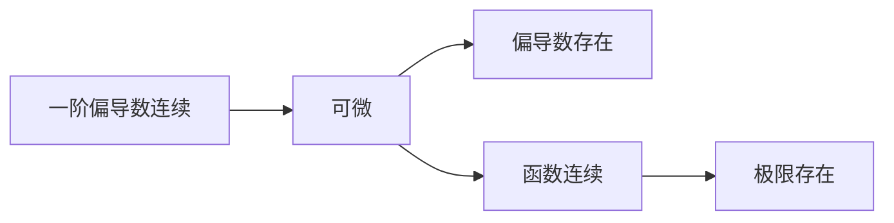

# 函数

单调性：$f'(x)>0$严格单增

## 极限

{/* $$$
\lim_{x \to \bullet} f(x) = A \Longleftrightarrow \forall \varepsilon > 0 ,when\;x\to \bullet, |f(x)-A|<\varepsilon. 
$$$ */}

1. $\lim f(x) = A$：极限存在，在某点的极限与该点的函数值的存在性和取值无关，左极限 = 右极限 = 该点函数值，则函数在该点连续
2. $\lim f_+(x) =\lim f_-(x)$:极限唯一
3. 等式脱帽：$\lim f(x) = A \Longleftrightarrow f(x) = A + \alpha(x), \lim \alpha(x) = 0$
4. 不等式脱帽：$A>0 \implies f(x) > 0$
5. 不等式戴帽：$f(x) \ge 0 \implies A \ge 0$

## 连续性
连续区间经过有限次复合而成的复合函数在定义域内连续
连续函数的4则运算连续
基本初等函数连续
初等函数定义区间内连续
连续单调的函数的反函数在对应区间仍然连续单调

:::info 函数极限的计算和存在性
1. 运算法则：需要保证在做拆分运算时，拆分后的极限各自存在
2. 等价无穷小：普通函数型；复合函数型；变上限积分型；推广型；恒等变形；
3. 洛比达法则
4. 泰勒公式
5. 夹逼准则和单调有界准则（数列较多）
:::

## 函数中值定理

$f(x)$在$[a,b]$上连续：

1. 有界定理：$m\le f(x)\le M$
2. 最值定理：$\exist a,b \to f(a) = m,  f(b)=M$
3. 介值定理：$m\le \mu\le M,\exist \xi\in[a,b]\to f(\xi)=\mu$
4. 平均值定理：$x_i\in[a,b], \exist \xi \in [x_1,x_n]\to f(\xi) = \dfrac{1}{n}\sum f(x_i)$
5. 零点定理：$f(a)\cdot f(b) < 0 \implies \exist \xi \in (a,b) \to f(\xi) = 0$

## 多级函数的性态关系

1. 某点可导一定连续，连续不一定可导
2. 左右导数存在（不需要相等），一定连续。但某点的导数并不能确定区间上单调性(一个点的导数不能确定一个区间)。
3. 不定积分存在定理：连续函数一定有原函数，第一类间断点不存在原函数，无穷间断点不存在原函数，振荡间断点可能存在原函数
4. 定积分存在定理：闭区间连续则一定可积。闭区间单调则一定可积。闭区间有界，间断点有限，可积。可积函数必有界。
5. 闭区间可积，则变上限积分函数连续
6. 闭区间连续，则变上限积分函数可导
7. 变限积分：闭区间可积，变限积分连续。（变限积分存在必连续）
8. 闭区间连续，变限积分可导。

## 数列

### 极限的计算和存在性

1. 充要条件：所有子数列均收敛于$A$.
2. 归结原则：连续变量的函数极限 = 离散变量的函数极限。
3. 定义法
4. 夹逼准则
5. 单调有界准则