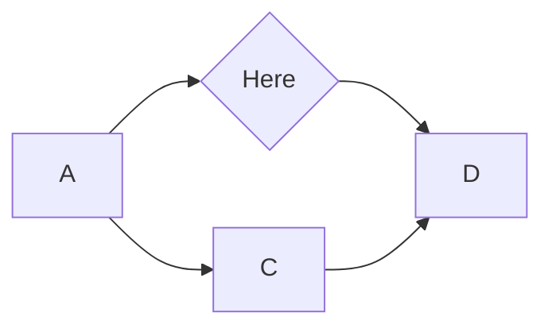
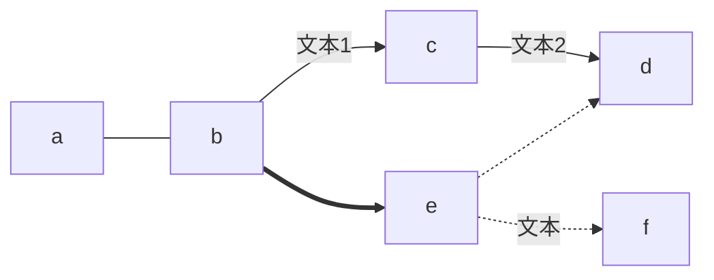
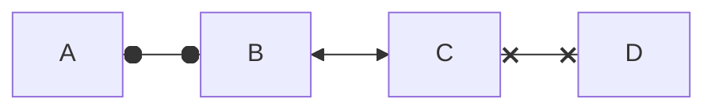
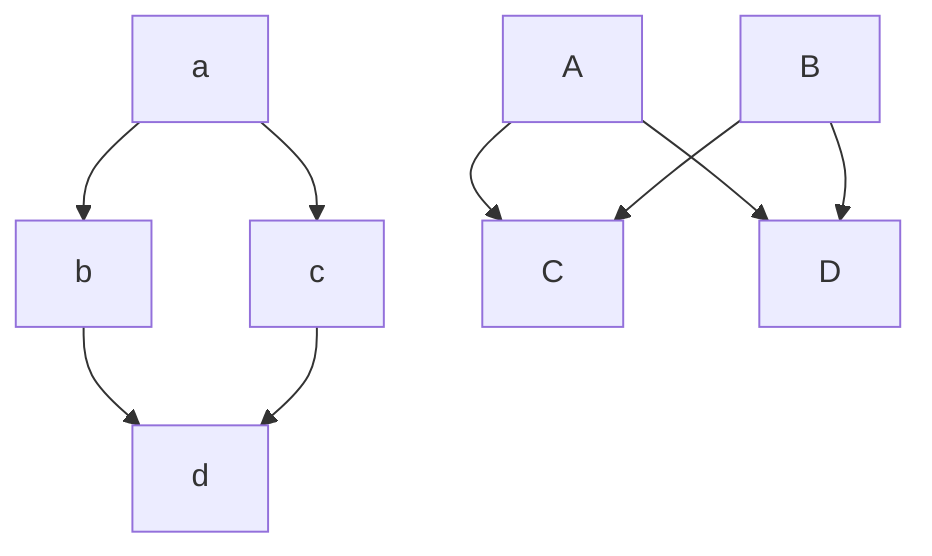
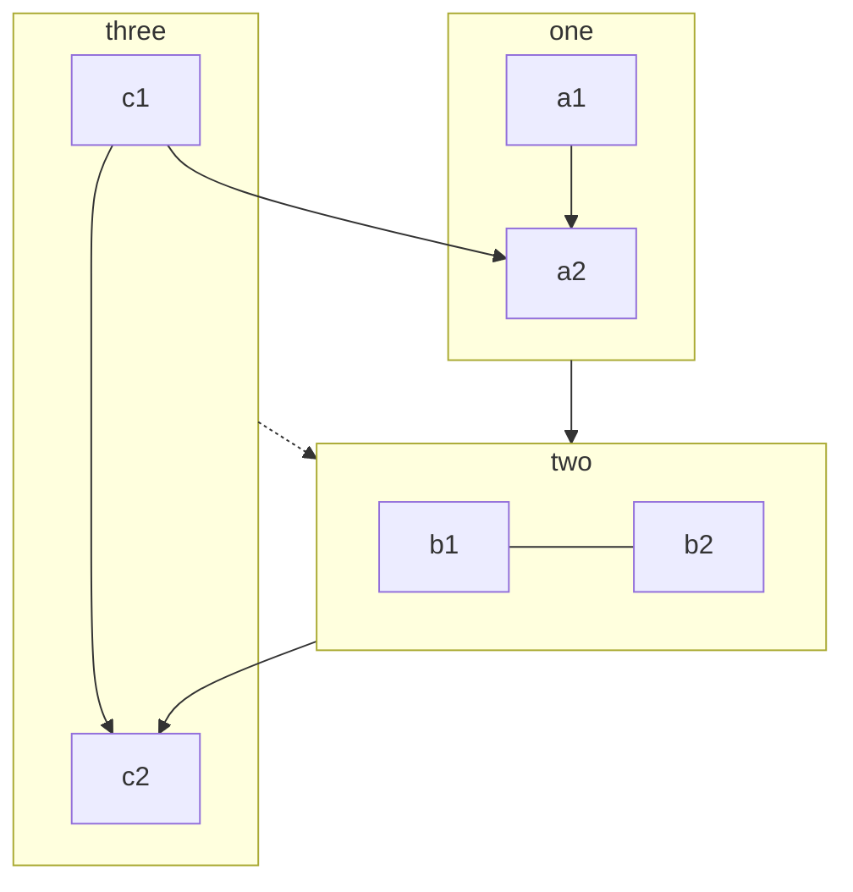
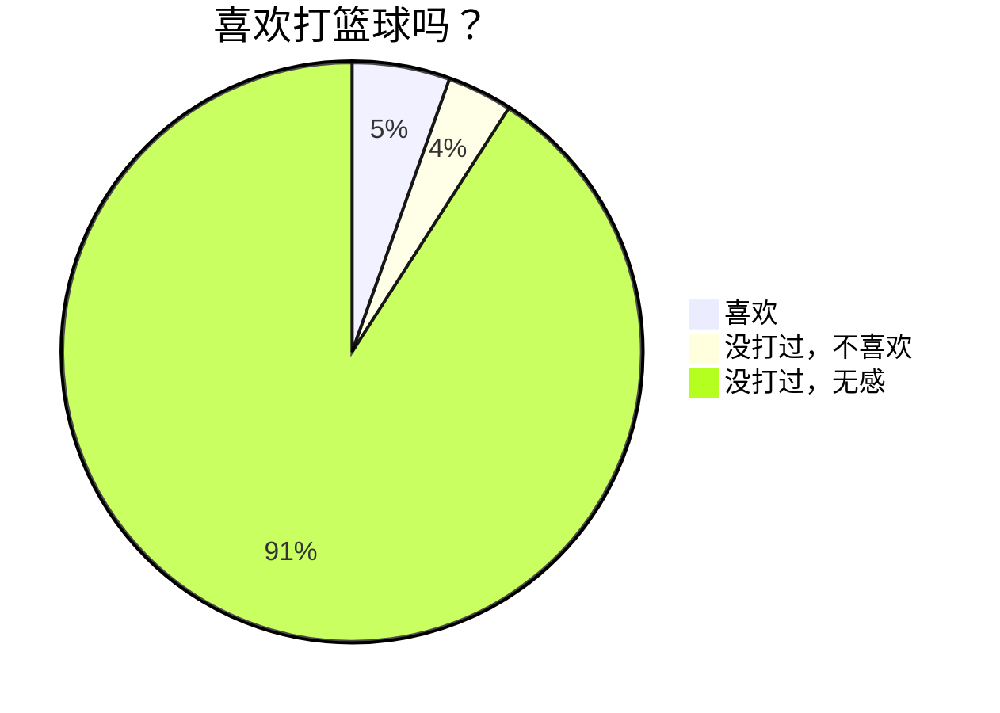

# UML

> unified modeling Language

统一建模语言。为面向对象开发系统的产品进行说明，可视化和编制文档的一种标准语言。

## mermaid

Mermaid是一种基于Javascript的绘图工具，使用类似于Markdown的语法，使用户可以方便快捷地通过代码创建图表。
饼状图：使用`pie`关键字，具体用法后文将详细介绍
流程图：使用`graph`关键字，具体用法后文将详细介绍
序列图：使用`sequenceDiagram`关键字
甘特图：使用`gantt`关键字
类图：使用`classDiagram`关键字
状态图：使用`stateDiagram`关键字
用户旅程图：使用`journey`关键字

下文使用mermaid绘制。

## 流程图

> 进程视图



````

````

:::info 方向
`graph` 或 `graph TB`或`graph TD`：从上往下

`graph BT`：从下往上

`graph LR`：从左往右

`graph RL`：从右往左
:::

```text title="节点形状"
默认方形
id1[方形]
id2(圆边矩形)
id3([体育场形])
id4[[子程序形]]
id5[(圆柱形)]
id6((圆形))
id7{菱形}
id8{{六角形}}
id9[/平行四边形/]
i10[\反向平行四边形\]
i11[/梯形\]
i12[\反向梯形/]
```

### 连线样式

实线箭头：分为无文本箭头和有文本箭头，有文本箭头有2种书写格式



````

````

其他连线

````mermaid
flowchart LR
    A o--o B
    B <--> C
    C x--x D
````
````

````

多重连接

````mermaid
flowchart
   a --> b & c--> d;
   A & B--> C & D;
````
````

````

子图

````mermaid
flowchart TB
    c1-->a2
    subgraph one
    a1-->a2
    end
    subgraph two
    b1---b2
    end
    subgraph three
    c1-->c2
    end
    one --> two
    three -.-> two
    two --> c2
````
````

````

## 饼状图

````mermaid
pie
    title 喜欢打篮球吗？
    "喜欢" : 30
    "没打过，不喜欢" : 20
    "没打过，无感" : 500
````

````

````
