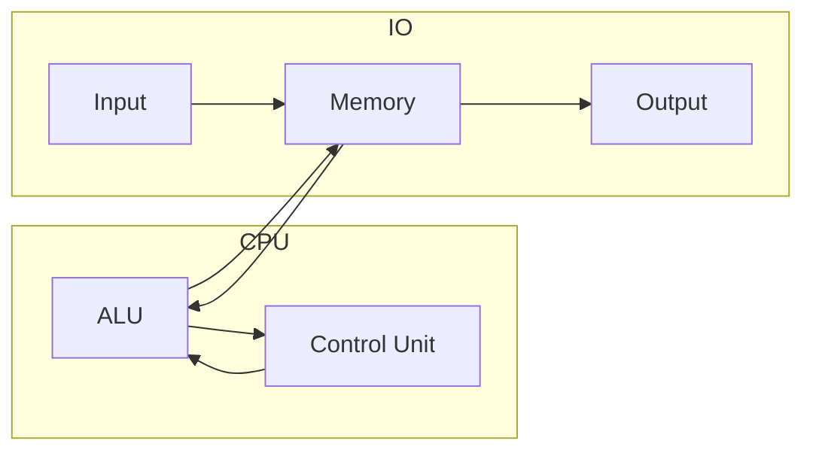

<Callout type="info" title="Architectures">
- **Harvard** – Instructions and data reside in separate memories, enabling parallel fetches.
- **Von Neumann** – A single memory stores both instructions and data. Core ideas:
  1. Uniform binary encoding for instructions/data, addressed by location.
  2. Hardware consists of ALU, control unit, memory, input, and output.
  3. Instructions contain opcodes plus operand addresses.
  4. Instructions are stored sequentially but control flow can change via branches.
</Callout>

## Performance Metrics

- **CPI** – Average cycles per instruction.
- **MIPS** – Millions of instructions per second.
- **External clock (FSB)** – Bus frequency used for CPU–memory transfers.
- **Multiplier** – Internal factor applied to the external clock; CPU frequency = FSB × multiplier (e.g., 333 MHz × 9 = 3.0 GHz). Overclocking typically adjusts the FSB because multipliers are locked.

Bus width (32-bit, 64-bit, etc.) indicates how many bits can be transferred per bus cycle. The CPU’s **word size** (32-bit vs. 64-bit) dictates how much data it can process per instruction and affects addressable memory space (32-bit address spaces cap at 4 GB without extensions).

Matching memory clocks to the CPU’s front-side bus maximizes throughput. Dual-channel memory doubles the effective data width (e.g., 2 × 64-bit).
