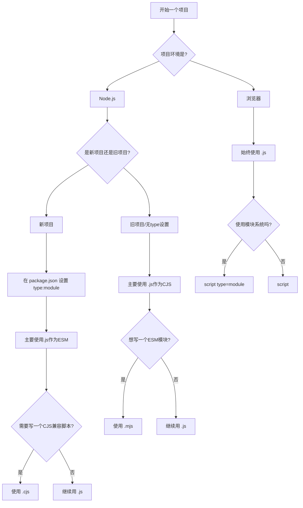

对于现代 TypeScript 项目，特别是从零开始的新项目（无论是 Node.js 后端还是使用现代构建工具的前端），最好的方案是全面拥抱原生 ​​ES​​​ 模块 (​​​ESM​​) 标准​。

这套方案保证了你的项目紧跟 JavaScript 的发展方向，具有最佳的生态兼容性和未来可维护性。

# 最佳实践​方案

这套方案的核心是让你的 TypeScript 开发环境，在模块解析和代码生成上，完全模拟现代 Node.js 的原生 ESM 行为。

## 配置 ​​`package.json`

在你的 `package.json` 文件中，添加 `"type": "module"`。这是启用 ESM 的开关。

```json
{
  "name": "my-modern-app",
  "version": "1.0.0",
  "type": "module",
  "scripts": {
    "dev": "tsx src/index.ts",
    "build": "tsc",
    "start": "node dist/index.js"
  },
  "devDependencies": {
    "typescript": "^5.0.0",
    "tsx": "^4.7.0", // 强大的零配置 TS 运行工具
    "@types/node": "^20.0.0"
  }
}
```

> ​`"type": "module"`​: 告诉 Node，项目中的 `.js` 文件默认应被当作 ES 模块来处理。
>
> Node.js 本身只认识 JavaScript。它看到 `.ts` 文件会一头雾水。`tsx` 就是为了解决这个问题而生的\*\*“即时翻译官”。
>
> 当您运行 `tsx src/index.ts` 时，`tsx` 在后台执行了以下魔法操作：
>
> 1. 读取 ​​TS​​ 文件: 它首先读取 `src/index.ts` 文件的内容。
> 2. 在​内存​中转译 (On-the-fly Transpilation):`tsx` 内部集成了一个非常快速的 TypeScript 转译器（比如 `esbuild`）。它会在内存中迅速地将 TypeScript 代码转换成 Node.js 能理解的 JavaScript 代码。这个过程非常快，而且​不会在你的硬盘上生成任何临时的 ​​`.js`​​​ 文件​（这和 `tsc` 命令会生成 `dist` 文件夹是不同的）。
> 3. 交给 Node.js 执行:`tsx` 将内存中新鲜出炉的 JavaScript 代码，直接“喂”给 Node.js 运行时去执行。
>
> 所以，`tsx` 扮演了一个中间人的角色，它无缝地连接了 TypeScript 开发和 Node.js 运行这两个世界。

## 配置 ​​`tsconfig.json`

这是你的核心编译配置。以下是一个推荐的模板：

```json
{
  "compilerOptions": {
    // --- 模块相关配置 (核心) ---
    "module": "NodeNext",
    "moduleResolution": "NodeNext",

    // --- 编译目标与输出 ---
    "target": "ES2022", // 针对现代 Node.js 版本，无需编译到很旧的 JS
    "outDir": "./dist", // 编译后的 JS 文件输出目录
    "rootDir": "./src", // TypeScript 源码根目录

    // --- 代码质量与健壮性 ---
    "strict": true, // 启用所有严格类型检查
    "esModuleInterop": true, // 改善对 CommonJS 模块的兼容性
    "forceConsistentCasingInFileNames": true, // 强制文件名大小写一致
    "skipLibCheck": true, // 跳过对 .d.ts 声明文件的检查，加快编译速度

    // --- 调试与开发 ---
    "sourceMap": true // 生成 source map 文件，方便调试
  },
  "include": ["src//*"], // 要编译的源文件范围
  "exclude": ["node_modules"] // 要排除的目录
}
```

- ​`"module": "NodeNext"`​: 指示 TypeScript 生成符合 Node.js ESM 标准的 `import`/`export` 语句。
- ​`"moduleResolution": "NodeNext"`​: 指示 TypeScript 在解析 `import` 路径时，严格遵守 Node.js ESM 的规则（即，必须写文件扩展名）。

## 调整编码习惯

这是最关键的一步：在你的 TypeScript 代码中，​所有相对路径的导入都必须包含 ​​`.js`​​​ 扩展名​。

​示例 (​​​`src/utils.ts`​):

```typescript
export function greet(name: string): string {
  return `Hello, ${name}!`;
}
```

​示例 (​​​`src/index.ts`​):

```typescript
// 正确 ✅: 导入时使用 .js 扩展名，即使实际文件是 .ts
import { greet } from "./utils.js";

console.log(greet("World"));
```

一开始可能会觉得有点奇怪，但请记住：​你写的这个路径是给最终编译出来的 ​​`.js`​​​ 文件看的，而不是给 ​​`.ts`​​ 文件看的。

## 为什么这是最好的方案？

1. ​面向未来 (Future-Proof)​: ESM 是 JavaScript 的官方标准，也是 Node.js 和浏览器生态的统一方向。现在采用意味着未来几年的技术债会更少。
2. ​生态兼容性 (Ecosystem Compatibility)​: 越来越多的 npm 包开始变为 "ESM-only"。使用 این方案可以无缝使用这些现代库，避免复杂的配置和打包问题。
3. ​明确性与无歧义 (Clarity & No Ambiguity)​: `import from './utils.js'` 非常明确地指向一个文件。不再有“魔术般”的路径解析，减少了潜在的错误。
4. ​同构代码 (Isomorphic Code)​: 如果你需要在浏览器和 Node.js 环境中共享代码，ESM 是通用的语言，能让代码复用变得更加简单。

# 备选方案：传统 CommonJS 方案

当然，在某些情况下，你可能不得不使用旧的方案。

适用场景：

- 维护一个庞大的、旧的 CommonJS (使用 `require`) 代码库。
- 依赖一个或多个关键的、不支持 ESM 的旧 npm 包。
- 项目构建工具链非常陈旧且难以升级。

配置方法：

1. ​`package.json`​: 不要设置 `"type": "module"`。
2. ​`tsconfig.json`​:
   1. `"module": "CommonJS"`
   2. `"moduleResolution": "node"` (或者 `classic`)
3. ​编码习惯​: 导入时不写扩展名。

```typescript
import { greet } from "./utils";
```

# 总结对比

| 方面                           | 现代ESM方案（推荐）     | 传统的CJS方案        |
| ------------------------------ | ----------------------- | -------------------- |
| package.json                   | type:"module"           | 不设置               |
| tsconfig.json                  | "NodeNext"              | "CommonJS"           |
| tsconfig.json moduleResolution | "NodeNext"              | "node"               |
| 导入路径                       | Import from './file.js' | Import from './file' |
| 使用场景                       | 新项目                  |
|                                |

结论：除非有非常充分的理由，否则所有新项目都应该首选“现代 ESM 方案”。 它将为你提供最平滑、最标准化的开发体验。

从 `.ts` 源文件到最终可被 Node.js 执行的 `.js` 文件，这个转换过程本身发生了什么。

这个过程通常被称为 ​“转译” (Transpilation)​，可以分解为以下几个核心步骤。整个过程由 TypeScript 编译器 (`tsc`) 来完成。

设想我们有这样一个源文件 `src/index.ts`:

```typescript
// src/index.ts
interface User {
  name: string;
  id: number;
}

function getUserName(user: User): string {
  console.log(`Fetching user with ID: ${user.id}`);
  return user.name;
}

const myUser: User = { name: "Alice", id: 101 };
const userName = getUserName(myUser);

export { userName };
```

当 `tsc` 介入时，它会经历以下旅程：

### 第一步：类型检查 (Type Checking)

这是 TypeScript 最核心的功能，也是它与 JavaScript 的根本区别。​在生成任何代码之前​，`tsc` 会像一位严格的语法老师一样，检查你的代码：

1. 读取配置:`tsc` 首先会查找并加载 `tsconfig.json` 文件，了解所有的编译规则（比如目标 JS 版本、模块系统、是否开启严格模式等）。
2. 构建类型上下文: 它会分析你所有的 `.ts` 文件以及你导入的任何库的类型定义文件 (`.d.ts`)，在内存中建立一个完整的“类型世界”。
3. 检查错误:`tsc` 会逐行检查你的代码，确保所有类型都匹配。
   1. 在我们的例子中，它会检查 `myUser` 是否符合 `User` 接口的形状。
   2. 它会检查传递给 `getUserName` 函数的参数是否是 `User` 类型。
   3. 它会检查 `getUserName` 函数的返回值是否是 `string` 类型。
   4. 如果你写了 `myUser.id = "101";`，`tsc` 会立刻报错，因为 `id` 被定义为 `number` 类型。

​如果在此阶段发现任何类型错误，​​`tsc`​​ 默认会停止编译并抛出错误。这是保证代码质量的第一道防线。

### 第二步：代码转换与擦除 (Transformation & Erasure)

当类型检查通过后，`tsc` 就开始将 TypeScript 代码转换为 JavaScript。这个过程主要做两件事：

1. 擦除所有 TypeScript 特有语法: JavaScript 运行时并不认识 `interface`, `type`, `: string` 这些类型注解。所以 `tsc` 会将它们​全部删除​，就像它们从未存在过一样。
   1. `interface User { ... }` -> (直接消失)
   2. `user: User` -> `user`
   3. `: string` -> (直接消失)
2. 转换新的 ECMAScript 特性: 如果你的 `tsconfig.json` 中 `target` 设置为一个较旧的 JavaScript 版本（例如 `ES6`），而你使用了更新的特性（例如 `ES2022` 的 `at()` 方法），`tsc` 会将这些新特性转换为旧版本兼容的等价代码。这被称为 Polyfill 或 ​down-leveling​。

经过这一步，我们的代码在概念上变成了这样：

```typescript
// 概念上的中间代码
function getUserName(user) {
  console.log(`Fetching user with ID: ${user.id}`);
  return user.name;
}

const myUser = { name: "Alice", id: 101 };
const userName = getUserName(myUser);

export { userName };
```

可以看到，所有类型信息都消失了，剩下的已经是纯粹的 JavaScript 逻辑。

### 第三步：模块系统转换 (Module System Transformation)

TypeScript 中我们通常使用 ES 模块 (`import`/`export`)。但是，传统的 Node.js 使用的是 CommonJS 模块系统 (`require`/`module.exports`)。

`tsc` 会根据 `tsconfig.json` 中的 `"module"` 配置项来决定如何转换模块导入和导出语句。

- 如果 `"module": "CommonJS"` (这是传统 Node.js 项目的常见配置):
  - `export { userName };` 会被转换为 `exports.userName = userName;`
  - `import { something } from './lib';` 会被转换为 `const { something } = require('./lib');`
- 如果 `"module": "NodeNext"` (现代 Node.js 项目的推荐配置):
  - `tsc` 会更智能地处理，可能会保留 `import`/`export` 语法，并确保生成的文件和 `package.json` 配置能够让 Node.js 正确地以 ES 模块模式运行。

### 第四步：文件生成 (Output Generation)

最后，`tsc` 将转换后的 JavaScript 代码写入到文件中，并放置在 `tsconfig.json` 中 `outDir` 指定的目录（通常是 `./dist`）。

最终生成的 `dist/index.js` 文件 (假设 `module` 为 `CommonJS`) 会是这样：

```typescript
"use strict";
// dist/index.js
Object.defineProperty(exports, "__esModule", { value: true });
exports.userName = void 0;
function getUserName(user) {
  console.log(`Fetching user with ID: ${user.id}`);
  return user.name;
}
const myUser = { name: "Alice", id: 101 };
const userName = getUserName(myUser);
exports.userName = userName;
```

- `"use strict";` 和 `Object.defineProperty` 这些是 `tsc` 为了确保模块兼容性和代码严谨性而自动添加的辅助代码。

同时，如果 `tsconfig.json` 中配置了 `"sourceMap": true`，`tsc` 还会生成一个 `dist/index.js.map` 文件。这个源映射文件记录了编译后的 `.js` 文件中的每一行代码对应回原始 `.ts` 文件中的哪一行。这就是为什么你在调试时，即使运行的是 JS，调试器也能让你在 TS 源码中断点和查看变量。

# 为什么ESM 需要写 `.js`

好的，这是一个非常经典且重要的问题。简单来说，ESM（ECMAScript Modules）之所以推荐甚至强制要求在导入路径中包含 `.js` 扩展名，核心原因是为了​明确性（Explicitness）和跨平台一致性（Consistency）​。

这与我们习惯的 CommonJS (require) 的行为有很大不同，下面我们来详细拆解一下原因。

## CJS (`require`) 的工作方式："智能"但复杂的解析

在 Node.js 的 CommonJS 模块系统中，当你写 `require('./myModule')` 时，Node.js 会在背后帮你做很多工作：

1. ​查找文件​：它会尝试寻找 `myModule.js`。
2. ​查找文件夹​：如果找不到，它会查找一个名为 `myModule` 的文件夹，并尝试加载该文件夹下的 `package.json` 中指定的 `main` 文件。
3. 查找 ​​​`index.js`​：如果上一步还没找到，它会继续在 `myModule` 文件夹下寻找 `index.js`。
4. 解析 ​​​`node_modules`​：如果路径不是相对路径（如 `require('lodash')`），它会逐级向上在 `node_modules` 文件夹中查找。

这种“智能”的解析机制在当时很方便，但也带来了问题：

- ​性能开销​：每次 `require` 都可能涉及多次文件系统查询，增加了I/O开销。
- ​不确定性​：代码的字面内容 `require('./myModule')` 无法唯一确定最终加载的是哪个文件，降低了代码的明确性。
- ​不兼容浏览器​：浏览器环境没有文件系统，无法实现这套复杂的解析逻辑。你不能在浏览器里直接 `require` 一个本地模块。

## ESM (`import`) 的设计哲学：明确与简单

ESM 在设计之初就旨在成为一个跨环境的、统一的模块标准，既能用于 Node.js，也能用于浏览器。为了实现这个目标，它采取了与 CJS 完全不同的策略。

ESM 要求导入路径必须是一个 URL（或类似 URL 的路径），这个路径必须能够被环境（浏览器或 Node.js）直接解析，而不需要猜测。

#### 在浏览器中：

- ​路径即 URL​：在浏览器中，`<script type="module" src="..."></script>` 和 `import` 语句中的路径都被当作 URL 来处理。浏览器发起网络请求时，必须知道确切的文件名，例如 `https://example.com/scripts/myModule.js`。浏览器不会去猜测你想要的是 `.js` 还是 `.mjs`，也不会去查找 `index.js`。
- ​明确性是关键​：`import { func } from './utils';` 会导致浏览器请求一个名为 `utils` 的文件，这几乎肯定会失败（除非服务器有特殊配置）。而 `import { func } from './utils.js';` 则会清晰地请求 `utils.js` 文件。

#### 在 Node.js 中：

为了与浏览器行为保持一致并解决 CJS 的一些历史问题，Node.js 在实现其 ESM 加载器时，也遵循了这种明确性的原则。

- ​默认需要扩展名​：当你使用 ESM (`"type": "module"` 或 `.mjs` 文件) 时，Node.js 要求你提供完整的相对文件路径，包括扩展名。这消除了文件系统查询的模糊性和性能开销。
- ​代码可移植性​：一段在 Node.js 中写的 ESM 代码，如果其依赖路径都写全了，那么它有更大的可能性不经修改或少量修改就能在浏览器中运行，反之亦然。

### 总结：为什么要写 `.js`？

1. ​明确性 (Unambiguous)​：`import './utils.js'` 精确地告诉加载器要加载哪个文件。代码的意图变得非常清晰，消除了 `require` 时代的模糊性。
2. ​跨平台兼容性 (Cross-platform Compatibility)​：这是核心原因。浏览器和服务器（Node.js）都能理解这种明确的路径格式。它是 Web 的标准工作方式，Node.js 为了统一而遵循了它。
3. ​性能 (Performance)​：避免了多次文件系统探测。加载器可以直接定位文件，而不需要尝试 `.js`、`/index.js` 等多种可能性。
4. ​符合 URL 标准​：ESM 将模块标识符（module specifier）视为 URL 的一部分，而在 URL 规范中，路径通常指向一个确切的资源，包含其文件名和扩展名。

### 有没有例外或解决方法？

虽然写全扩展名是 ESM 的标准实践，但在实际开发中，我们有时确实希望能省略它，就像在 CJS 中一样。现代工具链提供了一些方法：

1. ​构建工具（Bundlers）​：像 ​Vite​、Webpack 这样的构建工具在处理你的代码时，可以配置它们的解析器（resolver）来自动添加扩展名或处理 `index.js`，从而让你在开发时可以不写 `.js`。但请注意，这是构建工具提供的便利，而不是 ESM 或浏览器的原生行为。
2. ​Import Maps​：这是一个较新的浏览器功能（Node.js 也通过实验性标志支持），它允许你定义一个“导入映射表”。你可以将一个简短的别名映射到一个完整的 URL 路径。
3. HTML

```xml
<script type="importmap">
{
  "imports": {
    "my-module": "/lib/my-module.js",
    "lodash": "https://cdn.jsdelivr.net/npm/lodash-es/lodash.js"
  }
}
</script>
<script type="module">
import { capitalize } from 'lodash'; // 无需写完整路径console.log(capitalize('hello'));
</script>
```

1. ​Node.js 的 ​​`--experimental-specifier-resolution=node`​​​ 标志​：在旧版本的 Node.js 中，曾有一个实验性标志可以开启类似 CJS 的路径解析。但这个选项已在较新版本中被移除或不推荐使用，因为它违背了 ESM 的设计初衷。

​结论​：在编写 ESM 代码时，养成写全文件路径（包括 `.js` 或 `.mjs` 扩展名）的习惯是最佳实践。这能确保你的代码在 Node.js 和浏览器中都能可靠、高效地运行，同时也让代码本身更加清晰明了。

# .js/.cjs/.mjs

好的，这是一个非常实际的问题。选择使用 `.js`、`.cjs`还是 `.mjs` 扩展名，完全取决于你的项目环境、Node.js 的版本以及你在 `package.json` 中的配置。

首先，记住这两个关键点：

1. `package.json`​​​ 中的 ​​`"type"`​​​ 字段​：这个字段决定了 `.js` 文件的默认模块系统。
   1. `"type": "commonjs"` (默认值): `.js` 文件被当作 CommonJS (CJS) 模块处理。
   2. `"type": "module"`: `.js` 文件被当作 ECMAScript (ESM) 模块处理。
2. `.cjs`​​​ 和 ​​`.mjs`​​​ 是显式声明​：
   1. `.cjs` 文件总是被当作 CommonJS 模块。
   2. `.mjs` 文件总是被当作 ECMAScript 模块。
   3. 这两个扩展名的行为不受 `package.json` 中 `"type"` 字段的影响，它们的优先级更高。

### 使用场景与决策指南

#### 场景一：开始一个全新的 Node.js 项目

推荐方案：全面使用 ESM

在这种情况下，你应该将项目的主流技术栈定位在现代的 ESM 上。

1. 在 ​​`package.json`​​​ 中设置 ​​​`"type": "module"`​。

```json
{
  "name": "my-new-project",
  "version": "1.0.0",
  "type": "module" // ...
}
```

1. ​所有模块文件都使用 ​​`.js`​​​ 扩展名​。
   1. `main.js`
   2. `utils.js`
   3. `routes/user.js`

何时使用其他扩展名？

- ​`.cjs`​：如果你的新项目需要引入一个只能以 CommonJS 方式运行的旧配置文件或脚本（例如，某些老的构建脚本、配置文件还不支持ESM），你可以把这个特定文件命名为 `.cjs`。例如 `legacy-config.cjs`。这样 Node.js 就能正确地用 CommonJS 方式加载它，而你项目中的其他 `.js` 文件仍然是 ESM。

​总结​：新项目 -> `"type": "module"` -> 主要用 `.js`。

---

#### 场景二：维护一个旧的 Node.js 项目 (没有 `"type"` 设置)

默认状态：CommonJS

老的 Node.js 项目默认就是 CommonJS 环境。

1. `package.json`​​​ 中没有 ​​`"type"`​​​ 字段​，或者显式设置为 `"type": "commonjs"`。
2. ​所有现存文件都是 ​​​`.js`​，并且使用 `require()` 和 `module.exports`。

如何在这种旧项目中引入 ESM？

- ​使用 ​​​`.mjs`​：如果你想在旧的 CJS 项目中编写一个新的 ESM 模块（例如，你想使用顶层 `await`），你可以把这个新文件命名为 `.mjs`。
  - `old-code.js` (使用 `require`)
  - `new-feature.mjs` (使用 `import`/`export` 和 `await`)
- 你不能在 `old-code.js` 中用 `require('./new-feature.mjs')` 来加载它，而必须使用动态 `import()`：
- JavaScript

```javascript
// old-code.js
async function runNewFeature() {
    const newFeature = await import('./new-feature.mjs');
    newFeature.doSomething();
}
```

​总结​：旧项目 -> 默认 CJS -> 主要用 `.js`。如果想引入 ESM 功能，就为新模块使用 `.mjs`。

---

#### 场景三：开发一个需要同时兼容 CJS 和 ESM 的库 (双模块包)

推荐方案：明确区分两种格式

如果你在开发一个 npm 包，希望它既能被 `require()` 也能被 `import`，你需要提供两种格式的产出文件。

1. `package.json`​​​ 设置 ​​`"type": "module"` (推荐)
2. 在 `package.json` 的 `exports` 字段中定义两种入口：
3. json

```json
{
  "name": "my-dual-package",
  "version": "1.0.0",
  "type": "module",
  "main": "./dist/index.cjs", // 为旧版 Node.js 或 CJS 环境提供入口
  "module": "./dist/index.js", // 为打包工具提供 ESM 入口
  "exports": {
    "import": "./dist/index.js", // ESM 环境的入口
    "require": "./dist/index.cjs" // CJS 环境的入口
  }
}
```

1. 在 ​​`dist`​​​ 目录中​：
   1. `index.js`: 这是 ESM 版本的文件。
   2. `index.cjs`: 这是 CommonJS 版本的文件。通常由构建工具（如 Rollup、Vite）从你的源代码（通常是 ESM 格式）编译生成。

​总结​：开发双模块库 -> 在 `dist` 目录中同时提供 `.js` (ESM) 和 `.cjs` (CJS) 文件，并在 `package.json` 的 `exports` 字段中指明。

---

#### 场景四：编写浏览器端的 JavaScript

这个最简单。

- 传统方式 (不使用模块系统):
  - 直接用 `<script src="app.js"></script>`。文件用 `.js` 即可。
- 现代方式 (使用 ESM):
  - 使用 `<script type="module" src="app.js"></script>`。
  - 所有文件（`app.js`, `utils.js` 等）都​使用 ​​`.js`​​​ 扩展名​。
  - 浏览器不认识`.cjs` 或 `.mjs`。虽然某些服务器可能会为这些扩展名设置正确的 MIME 类型，但标准和最佳实践是在浏览器端始终使用 `.js`。

​总结​：浏览器环境 -> 始终使用 `.js`。

### 最终决策图谱

为了让你更清晰，可以参考下面的决策流程：


